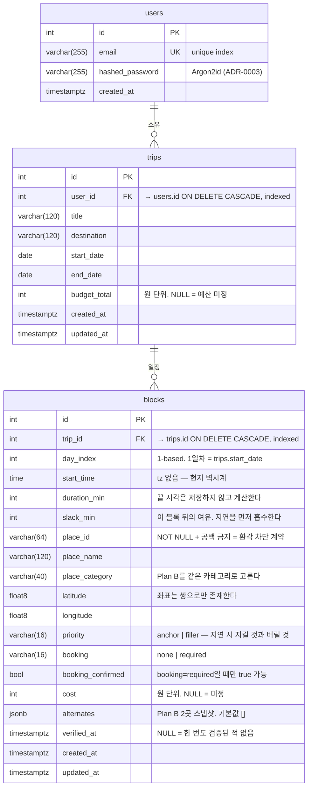

# ERD

세션 9 기준. 스키마를 바꾸면 이 파일도 같이 고친다 — 마이그레이션이 진실이고 이건 그 그림이다.

## 그림이 말하지 않는 것

**CASCADE 2단 체인이 곧 소유 경로다.** 회원이 지워지면 여행이, 여행이 지워지면 일정이
함께 사라진다. 같은 경로가 인가에도 쓰인다 — 블록에는 `user_id`가 없고, "내 여행인가"를
한 번 확인한 것이 그 여행의 모든 블록에 대한 권한이다. 인가 사실을 두 곳에 복제하면
어긋났을 때 어떤 제약으로도 잡을 수 없다 (ADR-0009).

**코드에는 `relationship()`이 없다.** 남의 도메인 테이블은 `ForeignKey("users.id")`처럼
문자열로만 가리키고, 모델을 import하지 않는다(CLAUDE.md 절대 규칙 / ADR-0008). 그래서 위
CASCADE는 ORM이 대신 지워주는 것이 아니라 **DB가 실제로 하는 일**이고,
`tests/test_blocks.py`가 그 사실을 붙잡는다.

**place가 테이블이 아닌 이유.** `blocks.place_*`는 살아있는 장소를 가리키는 포인터가 아니라
계획을 세운 시점의 스냅샷이다. 정규화해서 나중에 그 행을 갱신하면 "계획이 무엇을 보고
만들어졌는가"가 지워지고, 영업정보 변화를 감지하는 Phase 5의 비교 대상이 사라진다
(ADR-0009 결정 2).

**날짜를 블록에 복제하지 않는 이유.** 블록의 시각은 여행에 대한 상대 좌표다
(`day_index` + `start_time`). 여행 날짜를 하루 미뤄도 계획이 그대로 따라오고, 절대 날짜를
복제했다면 조용히 어긋났을 자리다. 그 불변식은 다른 테이블을 참조해야 해서 CHECK로 쓸 수 없다.

`blocks`에는 CHECK가 12개 있다. 전체 목록은 `migrations/versions/20260901_0003_create_blocks.py`
또는 `psql`의 `\d blocks`에서 볼 수 있다.
